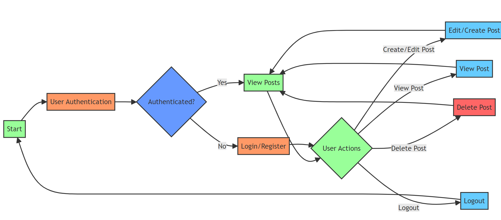

# MERN Blog Application


This is a full-stack blog application built using the MERN stack (MongoDB, Express.js, React.js, Node.js). It allows users to create, manage, and interact with blog posts.

## Folder Structure

```
BLOG-Application-MERN-
│
├── api
│   ├── models
│   │   ├── Post.js
│   │   └── User.js
│   ├── uploads
│   ├── index.js
│   ├── .gitignore
│   ├── package-lock.json
│   └── package.json
│
└── client
    ├── public
    │   └── index.html
    ├── src
    │   ├── App.css
    │   ├── App.js
    │   ├── index.css
    │   ├── index.js
    │   ├── pages
    │   │   ├── UserContext.js
    │   │   ├── RegisterPage.js
    │   │   ├── PostPage.js
    │   │   ├── Post.js
    │   │   ├── Layout.js
    │   │   ├── LoginPage.js
    │   │   ├── IndexPage.js
    │   │   ├── Header.js
    │   │   ├── EditPost.js
    │   │   ├── Editor.js
    │   │   └── CreatePost.js
    │   └── ...
    └── ...
```
## Flowchart



## Features

- **User Authentication**:
  - Register, login, and logout functionalities.
  - Secure authentication using JSON Web Tokens (JWT).

- **Rich Text Editing**:
  - Integrated React Quill editor for creating and editing formatted blog post content.

- **Post Management**:
  - Create, edit, and delete blog posts with ease.
  - Support for adding images, videos, and other media to posts.
  - Categorize posts and add tags for easy navigation.

- **User Profile**:
  - View and update user profiles, including profile pictures, bios, and social media links.

- **Pagination and Filtering**:
  - Paginate posts to display a limited number per page.
  - Filter posts based on categories, tags, or date ranges.

- **Real-time Updates**:
  - Notify users of new posts, comments, and other activities in real-time using WebSocket technology.

## Technologies Used

### Client Side:

- React
- React Router DOM
- React Quill
- Date-fns
- Axios
- Web Vitals
- Testing Libraries:
  - @testing-library/jest-dom
  - @testing-library/react
  - @testing-library/user-event

### Server Side (API):

- Node.js
- Express.js
- MongoDB
- Mongoose
- bcrypt & bcryptjs
- cookie-parser
- cors
- jsonwebtoken
- Multer
- Nodemon

## Installation

1. Clone the repository:
   ```bash
   git clone https://github.com/shivarajkulal/BLOG-Application-MERN-.git
   ```

2. Install dependencies for both client and server:
   ```bash
   cd BLOG-Application-MERN-
   cd api && npm install
   cd ../client && npm install
   ```

3. Configure environment variables:
   - Create a `.env` file in the `api` directory.
   - Add necessary environment variables (e.g., MongoDB connection string, JWT secret key).

4. Run the development server:
   - Start the API server:
     ```bash
     cd ../api && npm start
     ```
   - Start the React development server:
     ```bash
     cd ../client && npm start
     ```

5. Open your browser and navigate to `http://localhost:3000` to view the application.

## Contributing

Contributions are welcome! Please feel free to submit bug reports, feature requests, or pull requests.

## License

This project is licensed under the [MIT License](LICENSE).

---

This README file serves as a brief introduction to the MERN Blog Application, providing an overview of its features, technologies used, installation instructions, and guidelines for contributing. Feel free to expand upon it with more detailed information, usage examples, or any additional sections you find relevant.

Best Regards,
shivarajkulalsn884@gmail.com

